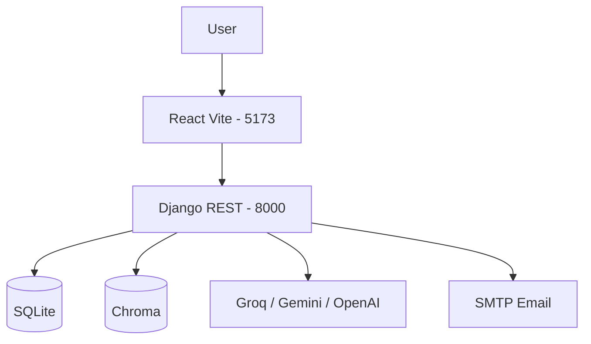
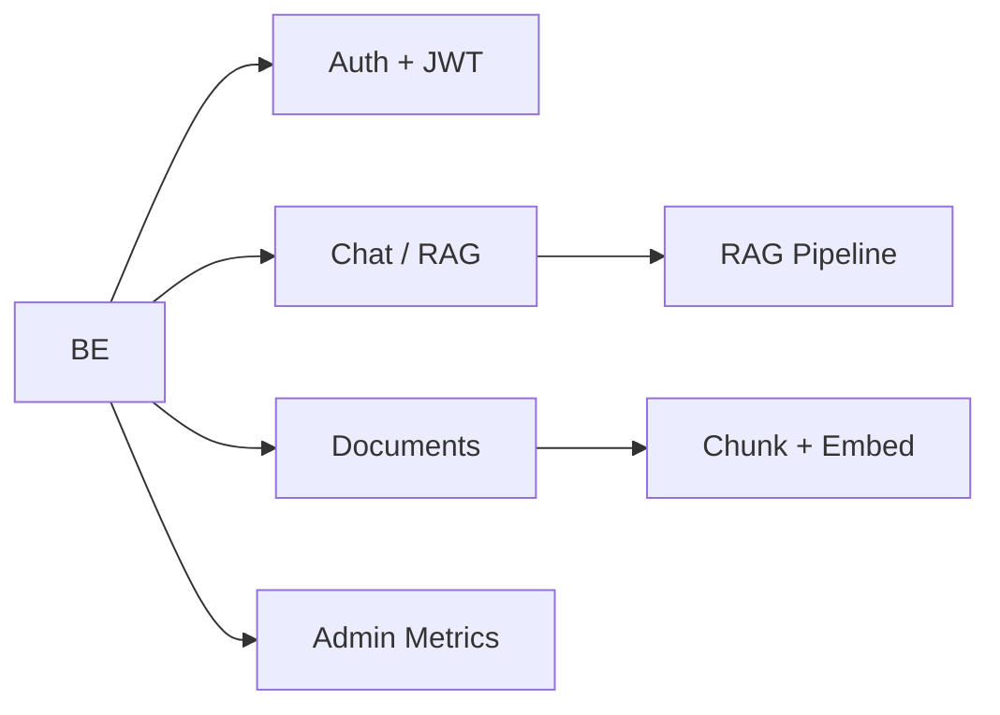
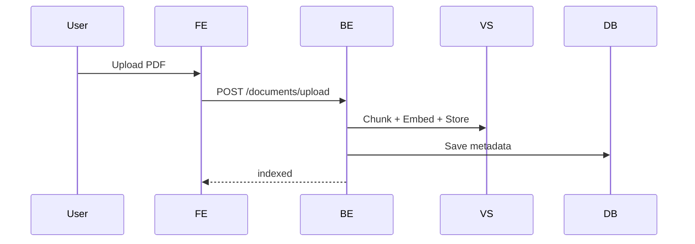
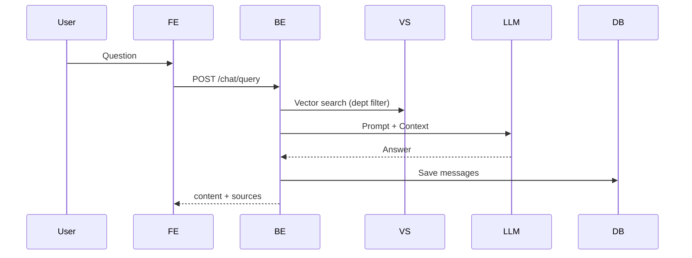
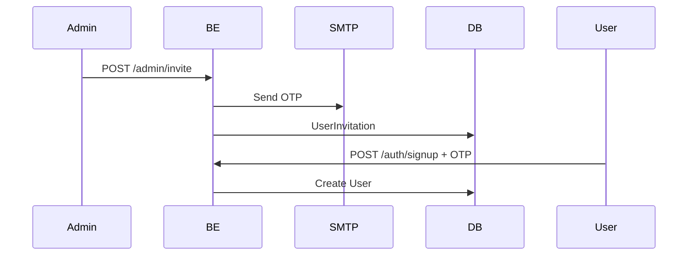
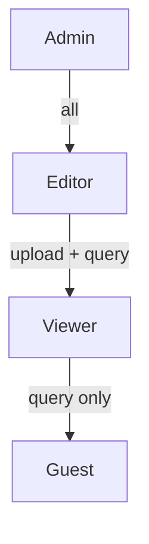
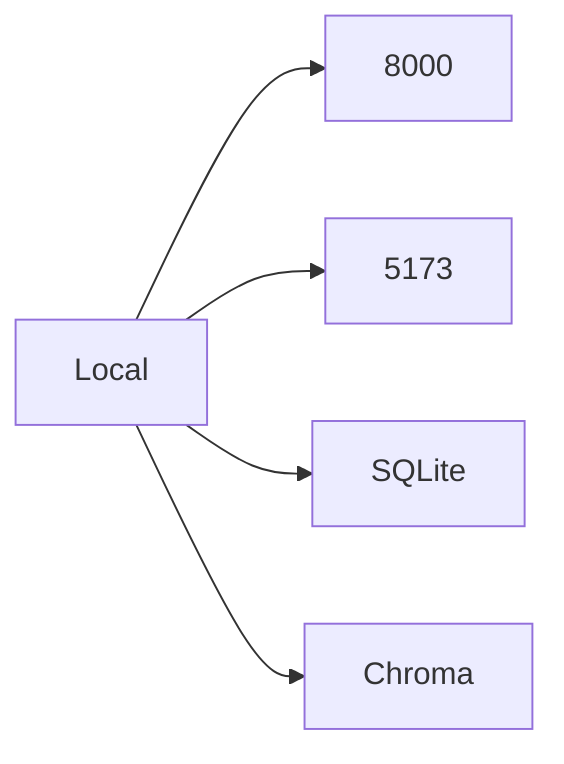

# High-Level Design — Document Intelligent System

## Overview
RAG app: upload docs → chunk & index (Chroma) → query with LLM. Roles: Admin / Editor / Viewer. Department isolation.

## Architecture

## Components

## Data Flows

**Upload**

**Query**

**Invite**

## Tech Stack
| Layer | Tech |
|-------|------|
| Frontend | React, Vite, 5173 |
| Backend | Django REST, 8000 |
| DB | SQLite |
| Vector | Chroma (Persistent) |
| LLM | Groq / Gemini / OpenAI |
| Auth | JWT |

## Roles

## Deployment

*Port 8000 only. No 8001.*
