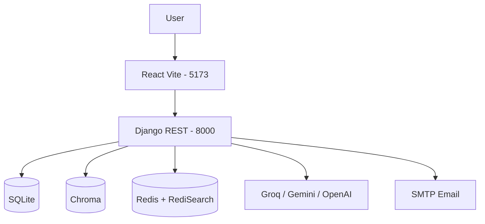
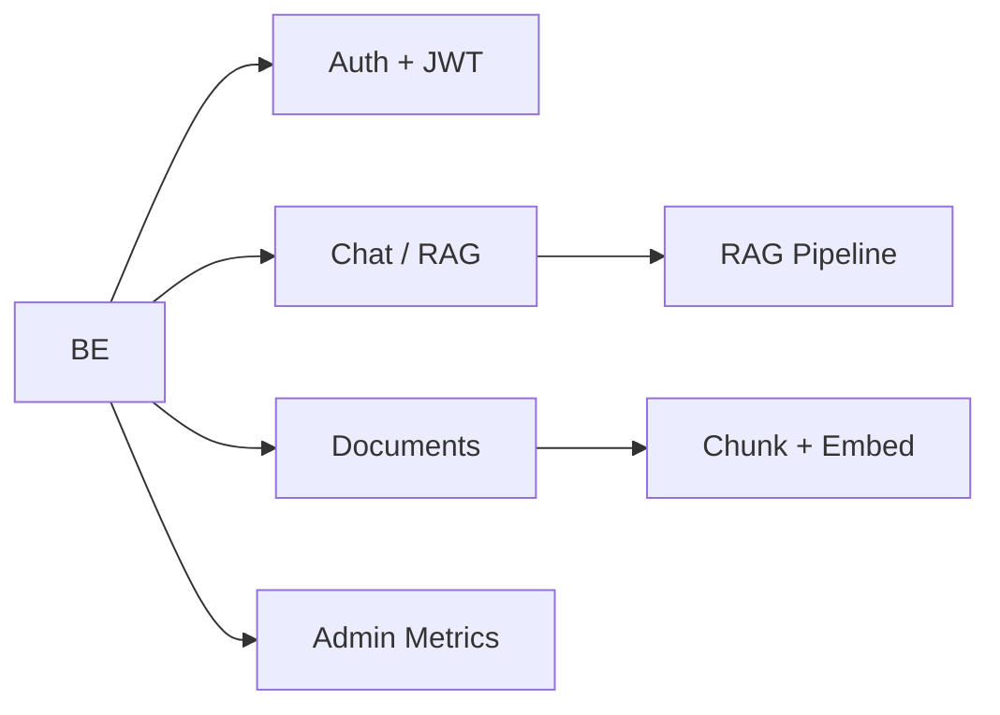
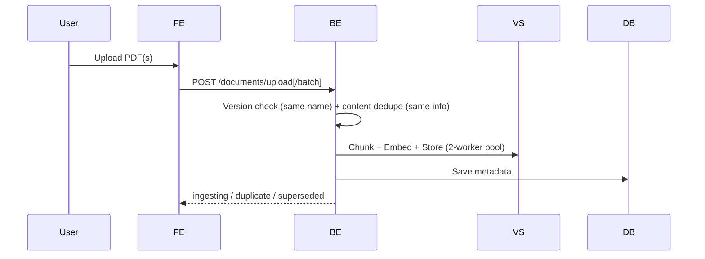
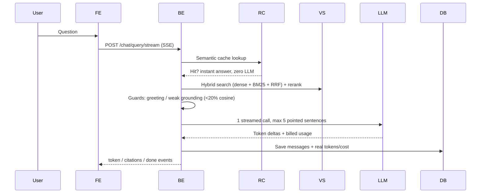
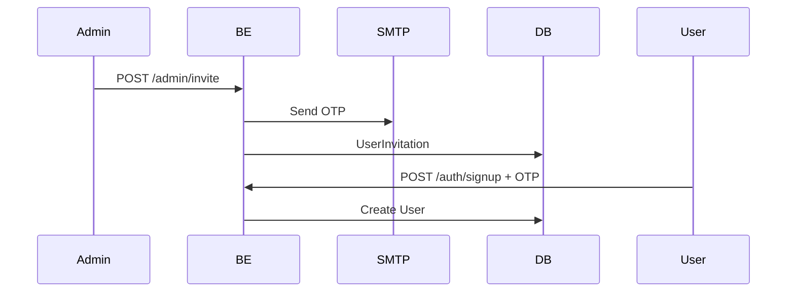
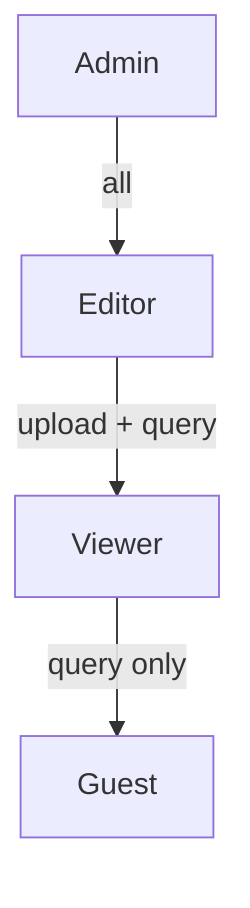
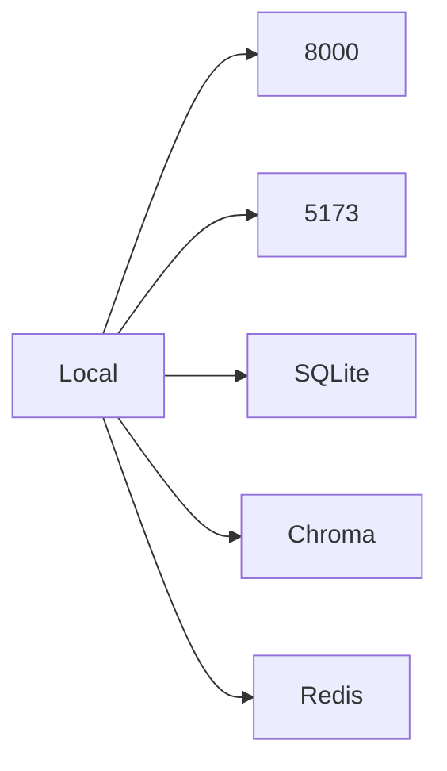

# High-Level Design — Document Intelligent System

## Overview
RAG app: upload docs → chunk & index (Chroma) → query with LLM. Roles: Admin / Editor / Viewer. Department isolation.

## Architecture

## Components

## Data Flows

**Upload (single or batch up to 1000 files)**

**Query (streamed, single LLM call)**

**Invite**

## Tech Stack
| Layer | Tech |
|-------|------|
| Frontend | React, Vite, 5173 |
| Backend | Django REST, 8000 |
| DB | SQLite |
| Vector | Chroma (Persistent, dept collections) |
| Cache | Redis + RediSearch (semantic/embedding/retrieval/rerank/prompt) |
| LLM | Groq / Gemini / OpenAI |
| Auth | JWT |

## Roles

## Deployment

*Port 8000 only. No 8001.*

## Tuning Flags

`INTRADOC_FAST_PATH=1`, `INTRADOC_SHORT_ANSWERS=1`, `INTRADOC_MAX_TOKENS=512`,
`INTRADOC_MIN_SIMILARITY=20` (true cosine %), `INTRADOC_INDEX_WORKERS=2`,
`INTRADOC_DUP_SIM_THRESHOLD=0.85`. Redis must load the RediSearch module
(`./start_redis.sh` handles it) or the semantic cache stays disabled.
